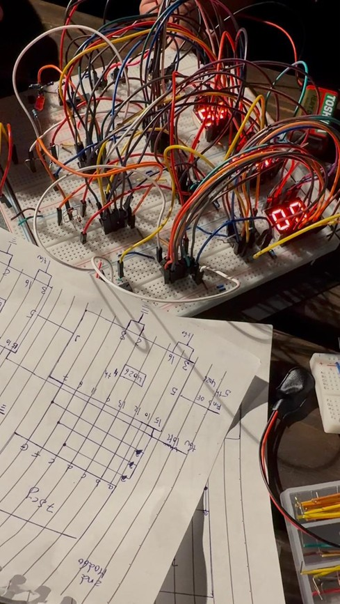

# [cite_start]Digital Clock Project [cite: 1]

## Overview
[cite_start]This document presents a digital clock circuit implemented without using a microcontroller[cite: 2]. [cite_start]The design is based entirely on digital integrated circuits such as counters, logic gates, diodes, resistors, a transistor, and a crystal oscillator[cite: 3]. [cite_start]The clock displays time in minutes and seconds using 7-segment displays[cite: 4]. [cite_start]The explanation is written in a simple and clear manner suitable for beginners and academic discussion[cite: 5].

## [cite_start]Project Members [cite: 6]
* [cite_start]Alyeldeen Ahmed Eldowaik – 241016698 [cite: 7]
* [cite_start]Youssef Mohamed – 241015841 [cite: 8]
* [cite_start]Yassin Hazem – 231000555 [cite: 9]

## [cite_start]Components Used [cite: 10]
* [cite_start]IC 4060 – Oscillator and binary counter (2 pieces) [cite: 11]
* [cite_start]IC 4026 – Decade counter with 7-segment driver (6 pieces) [cite: 12]
* [cite_start]IC 7400 – Quad 2-input NAND gate (1 piece) [cite: 13]
* [cite_start]NPN Transistor (1 piece) [cite: 14]
* [cite_start]Diodes (6 pieces) [cite: 15]
* [cite_start]7-Segment Displays (6 pieces) [cite: 16]
* [cite_start]Resistors (8 pieces total) [cite: 17]
* [cite_start]Timing Capacitor (1 piece) [cite: 18]
* [cite_start]Crystal Oscillator (1 piece) [cite: 19]
* [cite_start]Power Supply [cite: 20]

## [cite_start]Functional Description of Components [cite: 21]

### [cite_start]IC 4026 – Counter and Display Driver [cite: 22]
[cite_start]The IC 4026 is a digital counter that counts from 0 to 9[cite: 23]. [cite_start]Each time it receives a pulse, it increments the displayed number by one[cite: 23]. [cite_start]The IC is directly connected to a 7-segment display, so no external decoder is required[cite: 24]. [cite_start]When the count reaches its maximum value, it sends a signal to the next counter[cite: 25]. [cite_start]In this project, the IC 4026 is used to display seconds and minutes[cite: 26].

### [cite_start]IC 4060 – Timing Signal Generator [cite: 27]
[cite_start]The IC 4060 is responsible for generating a stable timing signal for the clock[cite: 28]. [cite_start]It includes an internal oscillator and a chain of counters[cite: 29]. [cite_start]When connected to a crystal oscillator and a capacitor, it produces steady pulses that control the counting process[cite: 30]. [cite_start]The user does not need to understand frequency calculations; the IC simply provides regular timing pulses[cite: 31].

### [cite_start]IC 7400 – NAND Logic Gates [cite: 32]
[cite_start]The IC 7400 contains four NAND gates[cite: 33]. [cite_start]These gates are used to detect specific counter states and determine when a reset is required[cite: 33]. [cite_start]This ensures that seconds and minutes reset correctly and do not exceed their limits[cite: 34].

### NPN Transistor & Diodes
* [cite_start]**NPN Transistor:** Used as a switch to strengthen reset signals[cite: 36]. [cite_start]Logic signals may be weak or unstable, so the transistor ensures a clean and reliable reset pulse is applied to the counters[cite: 37].
* [cite_start]**Diodes:** Allow current to flow in only one direction[cite: 39]. [cite_start]In this project, they are used to combine reset signals safely and prevent unwanted feedback between different stages of the circuit[cite: 39].

### Crystal Oscillator & Resistors
* [cite_start]**Crystal Oscillator:** Provides a stable reference signal for the clock[cite: 43]. [cite_start]This stability ensures accurate time keeping and prevents drift over long periods[cite: 44].
* [cite_start]**Resistors:** Eight resistors are used in the circuit[cite: 41]. [cite_start]These are responsible for current limiting, biasing the transistor, and ensuring correct logic levels throughout the system[cite: 41].

## [cite_start]System Operation [cite: 45]
1. [cite_start]When power is applied, the crystal oscillator and IC 4060 begin operating[cite: 46].
2. [cite_start]The IC 4060 generates regular timing pulses[cite: 46].
3. [cite_start]These pulses are fed into the IC 4026 counters[cite: 47].
4. [cite_start]Each 4026 updates its corresponding 7-segment display[cite: 47].
5. [cite_start]When a counter completes its cycle, it triggers the next stage[cite: 48].
6. [cite_start]NAND gates and diodes manage reset conditions[cite: 48].
7. [cite_start]The transistor ensures reliable reset operation[cite: 49].
8. [cite_start]The displays continuously show minutes and seconds[cite: 49].

## System Diagrams & Schematics

### Block Diagram

### Pulse Generation Schematic

### Mod-60 & Mod-12 Schematics

## Physical Implementation

[cite_start]*You can view a video of the working circuit [here](https://drive.google.com/file/d/1tiuvQU5EV8XumlfdopGbZydBgzEN-A4r/view?usp=drive_link).* [cite: 56]

> **Note on Tinkercad Simulation:** > A preliminary design was attempted in Tinkercad. However, due to limitations in the Tinkercad component library (specifically missing IC models and certain capacitor values used in our physical build), the simulated schematic differs from our final real-world physical implementation. The physical breadboard implementation is the final, fully functional version of this project.

## [cite_start]Conclusion [cite: 50]
[cite_start]This digital clock demonstrates how accurate timekeeping can be achieved using basic digital electronics without programming or microcontrollers[cite: 51]. [cite_start]The design is reliable, educational, and well-suited for understanding counters, logic control, and timing circuits[cite: 52].